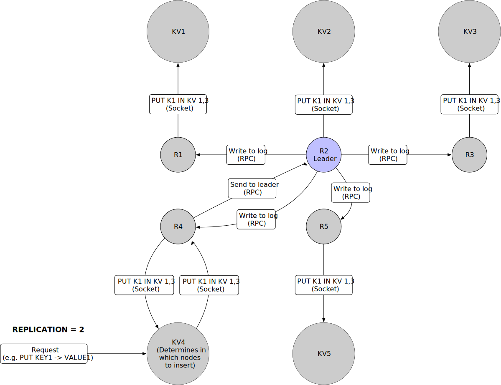

# Key Value store with raft consensus algorithm

## Setup

```bash
git clone https://github.com/notarisj/raft.git
```

```bash
cd raft
```

Generate the distribution package (optional)
```bash
python3 setup.py sdist
```

```bash
pip install dist/raft*.tar.gz
```

## Usage

### Running the Application
You can start the server using the [run_server.sh](src/raft_node/deploy/bash/run_server.sh) bash script. This script takes in a 
directory path and optional arguments for configuration. If no parameters are provided,
the script will use the default configuration from the [config.ini](src/raft_node/deploy/config.ini) 
file. Note that if you want to test it in the same machine, you need to change the ports
in [servers.json](src/raft_node/deploy/servers.json) and pass `--mongo_collection_name` 
for each node.

The usage is as follows:

Install mongodb (if not installed)
```bash
./src/raft_node/deploy/bash/install_mongodb.sh
```

Start the server:
```bash
./src/raft_node/deploy/bash/run_server.sh <directory_path> [options]
```

Example usage:
```bash
./src/raft_node/deploy/bash/run_server.sh . --server_id 1 --mongo_collection_name raft1
```

Options:

- `--server_id <server_id>`
- `--uvicorn_host <uvicorn_host>`
- `--uvicorn_port <uvicorn_port>`
- `--mongo_host <mongo_host>`
- `--mongo_port <mongo_port>`
- `--mongo_db_name <mongo_db_name>`
- `--mongo_collection_name <mongo_collection_name>`


Please refer to the [run_server.sh](src/raft_node/deploy/bash/run_server.sh) script for 
more details.

## Generate SSL certificate for th API
```bash
openssl req -newkey rsa:2048 -nodes -keyout private_key.pem -x509 -days 365 -out certificate.pem -subj "/CN=localhost" -addext "subjectAltName = IP:127.0.0.1, DNS:localhost"
```

## Communication Diagram
In the following diagram, the communication between the key value store and raft nodes is shown.


## License

This project is licensed under the MIT License - see the [LICENSE.md](LICENSE) file for details.