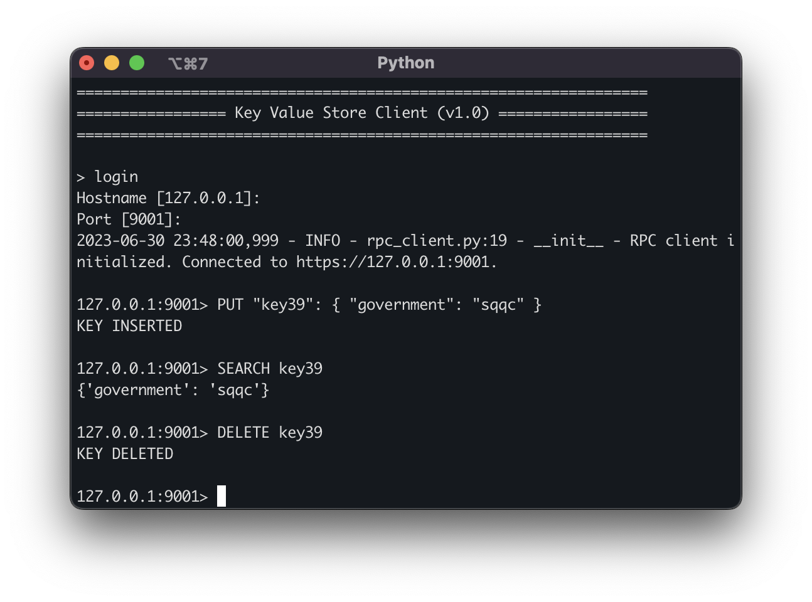

# KV Store CLI Tool

## Run

```bash
cd /path/to/raft
```

Execute the client
```bash
./run_raft_cli.sh
```

## Commands

 - `PUT` - Inserts a new key in the store. Usage `PUT <valid_json>`
 - `SEARCH` - Returns the value of a specific key. Usage `SEARCH <key>`. It can retrieve subdocuments as well. For example,
    if the key is `a.b.c` it will return the value of the key `c` inside the subdocument `b` inside the subdocument `a`.
 - `DELETE` - Deletes a key from the store. Usage `DELETE <key>`.
 - `LOGIN` - Logs in to the key value store. Authentication has not been implemented here. The user must provide the
host and port of the key value store. The host and port can be set in the 
[servers.json](../../../src/configurations/servers.json) file or with the raft cli tool.
 - `exit` - Exits the client


