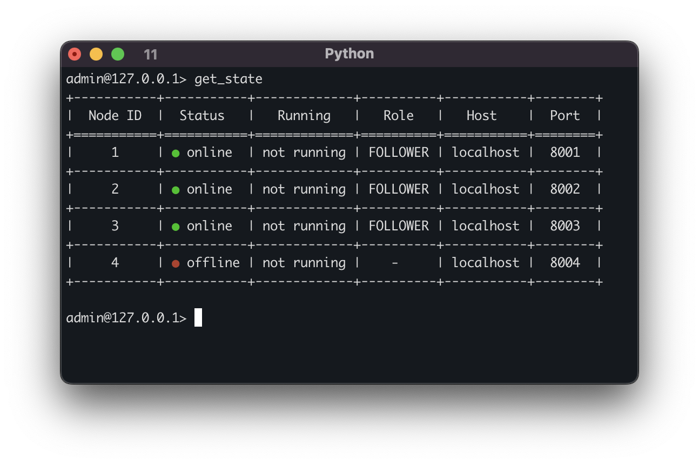

# Raft CLI Tool

## Run

```bash
cd /path/to/raft
```

Execute the client
```bash
./run_raft_cli.sh
```

## Commands

 - `start_cl` - Sends a command to all the raft nodes in the cluster to start. Each server will respond with a message
  indicating if it was able to start or not.
 - `stop_cl` - Sends a command to all the raft nodes in the cluster to stop. Each server will respond with a message
  indicating if it was able to stop or not.
 - `get_state` - Shows the current state of the raft cluster. The output is similar to the following:



- `edit_config` - Opens a tool to add, update and delete nodes from the cluster. It is quite unstable in this release. 
To work the cluster must be stopped first add the new node and then start the cluster again. The nodes that are already 
online will be updated. The output is similar to the following:


- `login` - Logs in to the cluster. The cli will be connected to a specific raft node. It does not matter if it is the 
leader or not. To connect, the user must provide the host, port and the credentials of the raft node. These credentials 
can be set in the [config.ini](../../../src/configurations/config.ini) file.
- `exit` - Exits the client